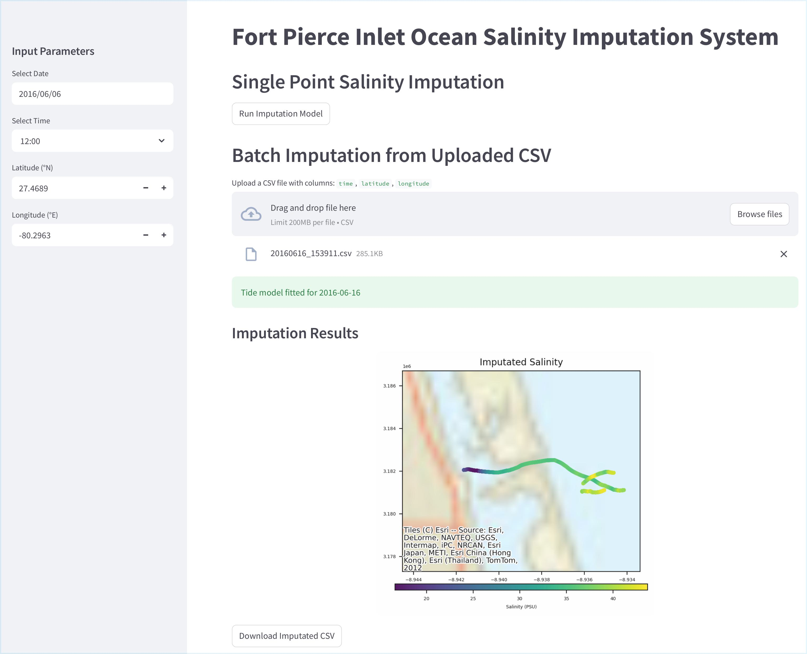

# 🌊 OASIS: Ocean Salinity Imputation System

> 📝 This repository accompanies the paper:  
> **"OASIS: Harnessing Adversarial Diffusion Network for Ocean Salinity Imputation using Sparse Drifter Trajectories"**  
> *(Under Review)*
> [[PDF Link]](TBD)
[[Web Demo]](https://fpoasis.streamlit.app/)
> 
**OASIS** is a web-based system for reconstructing sparse ocean salinity. It is designed for offshore and coastal scenarios where drifter data is sparse, noisy, or irregular. Powered by a adversarial diffusion framework, OASIS supports on-demand interactive and batch-mode salinity imputation with integrated access to NOAA tide data.

🌐 Live Demo:
[https://fpoasis.streamlit.app/](https://fpoasis.streamlit.app/)

## 🎯 Key Features

- ✅ On-demand Ocean Salinity imputation using Adversarial Diffusion Network model
- 📂 Support for single-point and multi-point (CSV) batch input
- 🌊 Integrated tide data retrieval from NOAA CO-OPS API
- 🧠 Transformer + Adversarial Diffusion model backend with tidal conditioning
- 🗺️ Geospatial map visualization and salinity trajectory display

## 📊 Example Usage
- 🌐 Query salinity at Fort Pierce Inlet for a given time and location
- 📂 Upload a CSV file with time, latitude, and longitude columns ([Download Sample CSV](./data/20160616.csv))
- 🗺️ Visualize salinity values on a color map with drift trajectories

## 🧠 Model
The model imputes salinity based on:
- 📅 Temporal features: hour, minute, day, month (sin/cos encoded)
- 📍 Spatial coordinates: latitude, longitude
- 🌊 Auxiliary covariate: tide level (fitted via NOAA data)

## 📃 License
MIT License.

For academic use, please cite.
